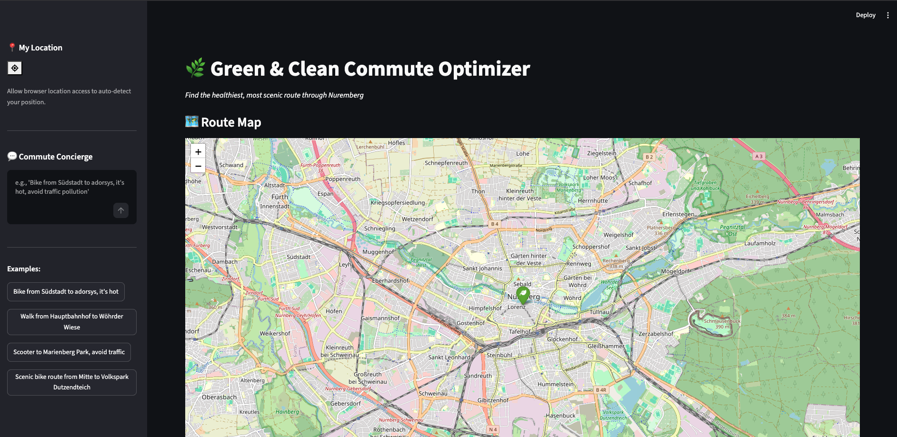

# Green & Clean Commute Optimizer

A Streamlit web app that finds healthy, scenic walking/cycling/e-scooter routes through **Nuremberg, Germany**. Describe your trip in natural language — "Bike from Südstadt to adorsys, it's hot, avoid traffic pollution" — and an AI agent geocodes locations, fetches 3 alternative routes, scores each against 7 environmental factors, and displays them on an interactive Folium map.

Built for the **Agentic Datathon** as a lightning-presentation demo.



## Features

- **Natural language queries** — describe your trip like you're talking to a concierge
- **3 alternative routes** — scored and ranked by environmental quality
- **7-factor scoring engine** — trees, water proximity, parks, quiet roads, air quality, heat comfort, historic sites
- **Interactive Folium map** — route polylines color-coded by score, segment-level heatmaps
- **Weather-aware** — live Open-Meteo data influences heat comfort scoring
- **Preference-adaptive** — automatically weighs factors based on your concerns (heat, pollution, scenery)
- **Offline fallback** — graceful degradation if any API is unavailable

## Architecture

```
app.py (Streamlit UI)
  ├── agent.py (LLM orchestration, LiteLLM + OpenAI tool calls)
  │     ├── routing.py (geocoding + routing via Nominatim/ORS/OSRM)
  │     ├── weather.py (Open-Meteo)
  │     └── scoring.py (7-factor segment scoring)
  │           └── data_fetch.py (Overpass API + file cache)
  ├── folium (map rendering)
  └── streamlit_geolocation (browser GPS)
```

## Quick Start

### Prerequisites

- Python 3.10+
- OpenRouteService API key (free at [openrouteservice.org](https://openrouteservice.org)) — optional, falls back to OSRM

### Setup

```bash
# Clone and enter the project
git clone <repo-url>
cd hackathon

# Create virtual environment
python -m venv .venv
source .venv/bin/activate

# Install dependencies
pip install -r requirements.txt

# Configure environment
cp .env.example .env
# Edit .env with your API keys
```

### Run

```bash
streamlit run app.py
```

Open the URL printed in your terminal (default: `http://localhost:8501`).

## Environment Variables

| Variable | Required | Default | Purpose |
|----------|----------|---------|---------|
| `ORS_API_KEY` | No | — | OpenRouteService routing + geocoding (free tier) |
| `LLM_PROVIDER` | No | `opencode` | `opencode`, `gemini`, or `ollama` |
| `LLM_API_KEY` | Yes* | — | OpenCode Zen or Gemini API key |
| `OPENCODE_MODEL` | No | `deepseek-v4-flash-free` | Model for OpenCode provider |
| `GOOGLE_API_KEY` | No | — | Required when `LLM_PROVIDER=gemini` |
| `GEMINI_MODEL` | No | `gemini-2.0-flash` | Model for Gemini provider |
| `OLLAMA_MODEL` | No | `llama3.2` | Model for Ollama (local, no key) |
| `OLLAMA_BASE_URL` | No | `http://localhost:11434` | Ollama server URL |

*\* Required for OpenCode and Gemini providers — not needed for local Ollama.*

## How It Works

1. **User enters a query** in natural language (e.g. "Walk from Hauptbahnhof to Marienberg Park, it's hot")
2. **Preference extraction** detects keywords (hot, pollution, scenic) to weight scoring factors
3. **LLM agent** plans and executes tool calls — geocodes origin + destination, fetches 3 routes, gets weather, scores routes
4. **Scoring engine** splits each route into 100m segments and scores each on 7 factors (0–10 per factor), weighted by detected preferences
5. **Map rendering** draws color-coded route polylines on a Folium map centered on the user's location
6. **Scorecards** show each route's score breakdown with Unicode bar charts

If the LLM is unreachable, a `_fallback_process()` runs the same pipeline with hardcoded coordinates.

## Project Structure

```
hackathon/
├── app.py              # Streamlit UI entry point
├── agent.py            # LLM orchestration (tool-calling loop)
├── routing.py          # Geocoding + routing (Nominatim/ORS/OSRM)
├── weather.py          # Open-Meteo integration
├── scoring.py          # 7-factor route scoring engine
├── data_fetch.py       # Overpass API + cached GIS data
├── data/               # Fallback GeoJSON + air quality CSV
│   ├── trees.geojson
│   ├── parks.geojson
│   ├── water.geojson
│   ├── historic.geojson
│   └── air_quality.csv
├── cache/              # Auto-generated API caches (2h TTL)
├── requirements.txt
└── .env                # API keys (not tracked in git)
```

## Tech Stack

- **Frontend:** Streamlit, Folium, streamlit-folium
- **LLM:** LiteLLM (OpenCode Zen / Gemini / Ollama)
- **Geocoding:** Nominatim (OSM), OpenRouteService
- **Routing:** OpenRouteService (primary), OSRM (fallback)
- **Weather:** Open-Meteo (free, no key)
- **GIS Data:** Overpass API (OSM), cached as GeoJSON
- **Spatial:** Shapely, Haversine formula
